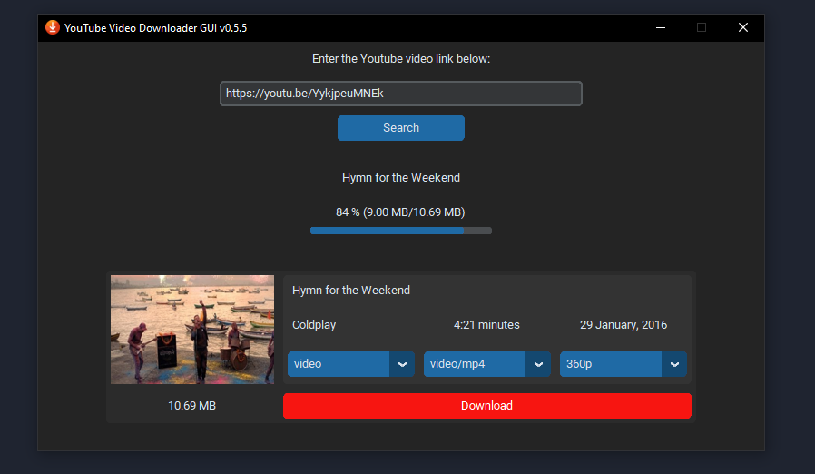

# **YTVideoDownloaderGUI**

#### **version 0.5.5**

##### changes:

* Add `__init__.py` file inside utils directory and import all the modules in it to make it a package.
* Renamed variables, added more contants & arranged them properly
* Changed button hover color
* Fixed multiple progress bar appearing (when download button clicked multiple times) issue
* Increased the space between the Download frame and Progress frame.
* Disabled window resizing

##### Screenshots

###### Downloading video:

---

#### **version 0.5.4**

##### changes:

* Refactor the entire code into object oriented.

##### features:

* Added feature to choose the download type (video, audio, video only) with respective file types and quality (resolution/average bitrate)
* Along with the downloaded percentage, (downlaoded size / total file size) will be shown.
* Display thumbnail image.
* Video details like, video title, channel name, video duration, published date will be shown with the download options.
* File size will be displayed once the download options are selected.

##### Screenshots

###### Main window:

###### Download options:

###### Downloading video:

###### File exists prompt:

---

#### **version 0.4.3**

##### features:

* Added function to check if the file is already present in the given download folder path if it is then, prompt the user to continue/cancel or change the download path.

##### Screenshots

###### File exists prompt:

---

#### **version 0.3.3**

##### changes:

* Added type hinting
* Code refactoring

##### features:

* Download the highest resolution

---

#### **version 0.3.2**

##### features:

* Added progressbar

##### Screenshots

###### progressbar:

---

#### **version 0.2.2**

##### changes:

* changed the app layout

##### Screenshots

###### App v0.2.2

---

#### **version 0.2.1**

##### features added:

* Added download time to the success message
* Centered the app window
* Changed the icon

##### Screenshots

###### App v0.2.1

###### Download success message:

###### Download cancelled message:

###### Invalid URL error message:

###### Invalid video id error message:

###### Empty URL error message:

---

#### version 0.1.0

A simple GUI for downloading Youtube videos using Python.

##### features:

* Downloads single youtube video.
* Show error message if no URL entered or and invalid URL is entered.
* Let the user choose the download location.
* Show success message with download path after the video is downloaded.

##### Screenshots

###### App v0.1.0

###### Download success message:

###### Download cancelled message:

###### Invalid URL error message:

###### Empty URL error message:

