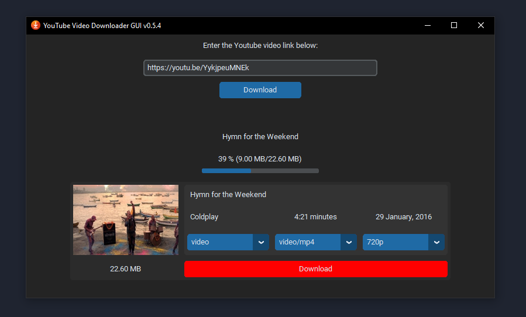

# **YTVideoDownloaderGUI**

        

###### version 0.5.4

A GUI for downloading Youtube videos using Python.

## Features:

* Downloads single YouTube video with highest resolution.
* Allows user to choose the download location & verifies it.
* Shows progress of the download.
* Choose download type (video, audio, video only) with respective file types and quality (resolution/average bitrate)

### Release notes:

Refer [CHANGELOG.md](CHANGELOG.md) for release notes.

### Dependencies:

* `CTkMessagebox==2.0`
* `customtkinter==5.1.3`
* `pytube==15.0.0`
* `Pillow==9.5.0`

Refer [requirements.txt](requirements.txt) for complete list of dependencies.

### Packaging:

`pyinstaller --noconfirm --onedir --windowed --add-data "<path\to\library_1\source;destination>" --add-data "<path\to\library_2\source;destination>" "<gui_file.py>"`

After running the above command, the `.exe` file will be available in the `dist/gui` folder.

### Screenshots

###### Main window:

###### Download options:

###### Downloading video:

###### Download success message:

###### File exists prompt:

###### Download cancelled message:

###### Invalid URL error message:

###### Invalid video id error message:

###### Empty URL error message:

