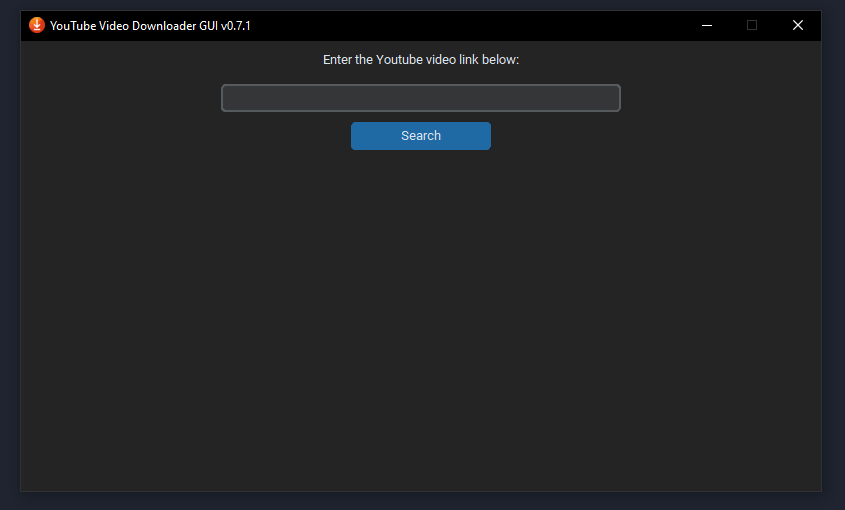
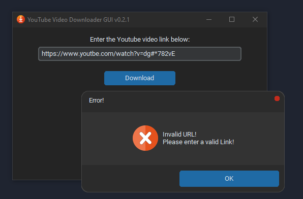

# **YTVideoDownloaderGUI**

        

A GUI for downloading Youtube videos using Python.

## Features:

* Downloads YouTube video in any available format with high quality.
* Allows user to choose the download location.
* Shows progress of the download.
* Choose download type (video, audio, video only) with respective file types and quality (resolution/average bitrate)
* Added logging feature.

### Release notes:

Refer [CHANGELOG.md](CHANGELOG.md) for release notes.

### Dependencies:

* `CTkMessagebox`
* `customtkinter`
* `yt-dlp`
* `Pillow`
* `python-dotenv`

Refer [requirements.txt](requirements.txt) for complete list of dependencies.

### Environment variables:

* All environment variables are mentioned in the *env.sample* file.
* Environment variables can also be stored in a *.env* file.
* If environment variables are not available, no errors will be shown instead default values will be taken.

### Packaging:

`pyinstaller --noconfirm --onedir --windowed --add-data "<path\to\library_1\source;destination>" --add-data "<path\to\library_2\source;destination>" "<gui_file.py>"`

After running the above command, the `.exe` file will be available in the `dist/gui` folder.

### Screenshots

###### Main window:

###### Download options:

###### Downloading video:

###### Download success message:

###### Download cancelled message:

###### Invalid URL error message:

###### Empty URL error message:

