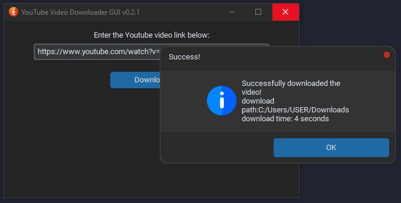

# **YTVideoDownloaderGUI**

###### version 0.2.1

A simple GUI for downloading Youtube videos using Python.

### Release notes:

Refer [release_notes.md](release_notes.md) for release notes.

### Dependencies:

* `CTkMessagebox==2.0`
* `customtkinter==5.1.3`
* `pytube==15.0.0`

Refer [requirements.txt](requirements.txt) for complete list of dependencies.

### Packaging:

`pyinstaller --noconfirm --onedir --windowed --add-data "<path\to\library_1\source;destination>" --add-data "<path\to\library_2\source;destination>" "<gui_file.py>"`

After running the above command, the `.exe` file will be available in the `dist/gui` folder.

### Screenshots

###### App v0.2.1

###### Download success message:

###### Download cancelled message:

###### Invalid URL error message:

###### Invalid video id error message:

###### Empty URL error message:

