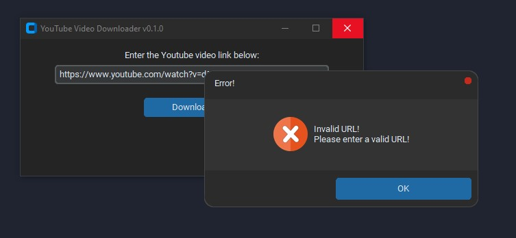

# **YTVideoDownloaderGUI**

#### **version 0.2.1**

##### features added:

* [X] Show download time with success message
* [X] Center the app window

##### Screenshots

###### Download success message with download time:

---

#### version 0.1.0

A simple GUI for downloading Youtube videos using Python.

##### features:

* Downloads single youtube video.
* Show error message if no URL entered or and invalid URL is entered.
* Let the user choose the download location.
* Show success message with download path after the video is downloaded.

##### Screenshots

###### App v0.1.0

###### Download success message:

###### Download cancelled message:

###### Invalid URL error message:

###### Empty URL error message:

